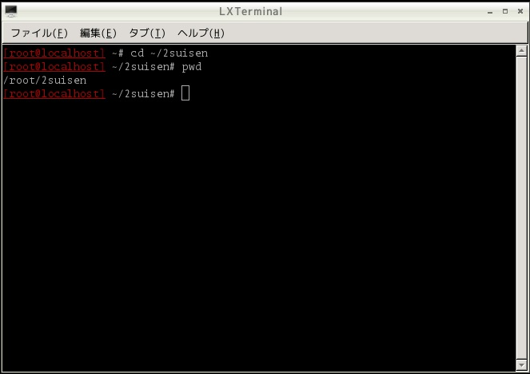
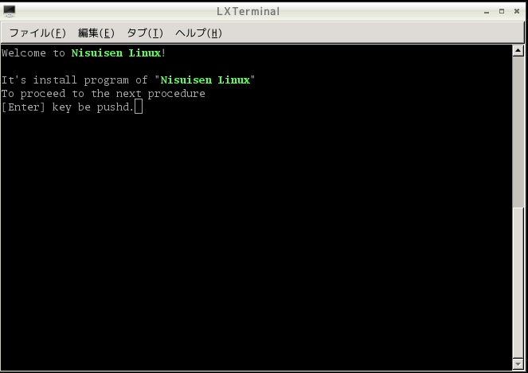
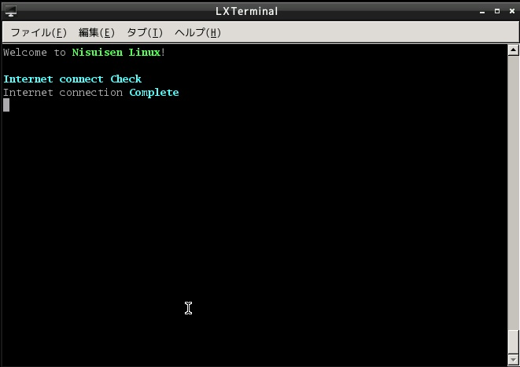
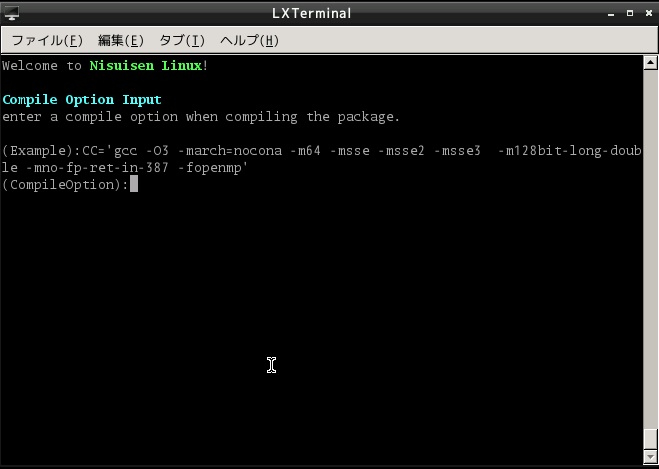

# Nisuisen-LINUX

  
  
  
Nisuisen Linuxは 私の会社、合同会社セグメンテーション・フォルト が開発したLinuxディストリビューションです。  
LFS Book及びBLFSをベースに構成されており、デスクトップ環境はLXDEを採用しています。  
インストール作業を行わずにコンピュータを使用できるようにDriveImageやLive DVD媒体にて配布をしております。  
勿論、Live DVD等に付属するインストーラーにて目的のコンピュータにインストールすることも可能です。  
Nisuisen Linux はシステムに必要な全てのプログラムをソースコードからビルドしますのでインストールに時間が掛かりますが、  
ハードディスクにインストールされたNisuisen LinuxのパフォーマンスはLAMP環境をはじめとするサーバ用途或いは  
WindowsXPに代わるクライアント用途として圧倒的なパフォーマンスと鉄壁の堅牢性を発揮します。  
驚くべきパフォーマンスと堅牢性の原因は「任意のビルドオプション定義」と「純粋なbinutils」の採用にあります。  

# ①Nisuisen Linux ハードディスクへのインストール方法
１．コマンドラインで操作します。rootを使用します。  
以下のようにコマンドを入力し、カレントをインストール用のフォルダに指定します。  

cd ~/2suisen   

  

２．以下のようにコマンドを入力し、インストールプロクラムを起動します  

./2suiSenLFS.sh  
  

３．エンターキーを押せという旨のメッセージが表示されています。  
[Enter]キーを押下して下さい。  
  

この画面ようにインターネットへの接続確認を行います。
  
